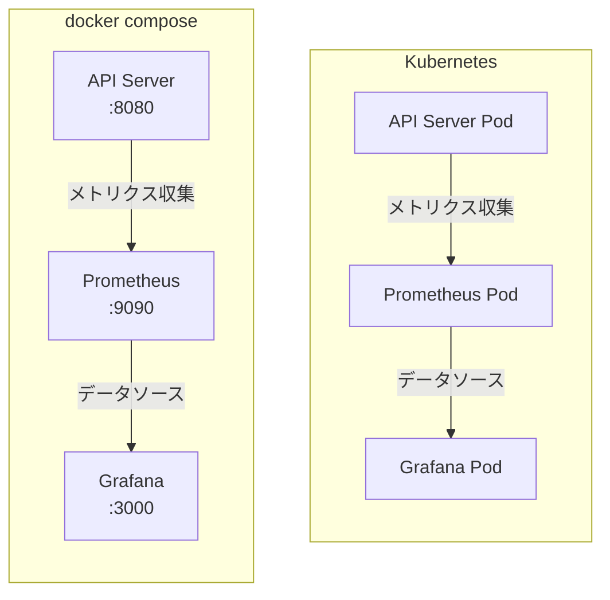

# Infra Lab

モダンなインフラの学習環境です。

## 技術スタック

### コンテナ化

- Docker
- Docker Compose

### オーケストレーション

- Kubernetes
- kind (Kubernetes in Docker)

### モニタリング

- Prometheus
- Grafana

### CI/CD

- GitHub Actions
- ArgoCD

### インフラストラクチャ

- Nginx Ingress Controller
- SSL/TLS

## アーキテクチャ



## プロジェクト構成

```
.
├── apps/
│   └── api-server/        # Go製APIサーバー
├── infra/
│   └── k8s/              # Kubernetes設定
│       ├── argocd/       # ArgoCD設定
│       ├── base/         # ベースKubernetes設定
│       └── monitoring/   # モニタリング設定
├── monitoring/
│   ├── grafana/         # Grafana設定
│   └── prometheus/      # Prometheus設定
└── docker-compose.yml   # ローカル開発環境設定
```

## クイックスタート

### ローカル Kubernetes 環境（kind）

```bash
# すべてのコンポーネントを一度にセットアップ
make setup-local

# 環境の削除
make kind-delete
```

## アクセス方法

| サービス   | URL                         | ポート | 備考                 |
| ---------- | --------------------------- | ------ | -------------------- |
| API Server | http://localhost/api        | 8080   | Go 製 API            |
| Prometheus | http://localhost/prometheus | 9090   | メトリクス収集       |
| Grafana    | http://localhost/grafana    | 3000   | 可視化ダッシュボード |
| ArgoCD     | https://argocd.localhost    | 443    | GitOps               |

## 学習ポイント

### 1. コンテナ化技術

- Docker Compose による複数コンテナの管理
- コンテナ間の連携

### 2. モニタリング基盤

- Prometheus によるメトリクス収集
- Grafana による可視化
- モニタリングの基本的な設定

### 3. Kubernetes

- 基本的な Kubernetes リソースの定義
- コンテナオーケストレーション
- ArgoCD による GitOps

## 必要条件

| ツール         | 用途                      |
| -------------- | ------------------------- |
| Docker         | コンテナ実行環境          |
| Docker Compose | コンテナ管理              |
| kubectl        | Kubernetes 操作           |
| kind           | ローカル Kubernetes 環境  |
| make           | ビルド自動化              |
| helm           | Kubernetes パッケージ管理 |
